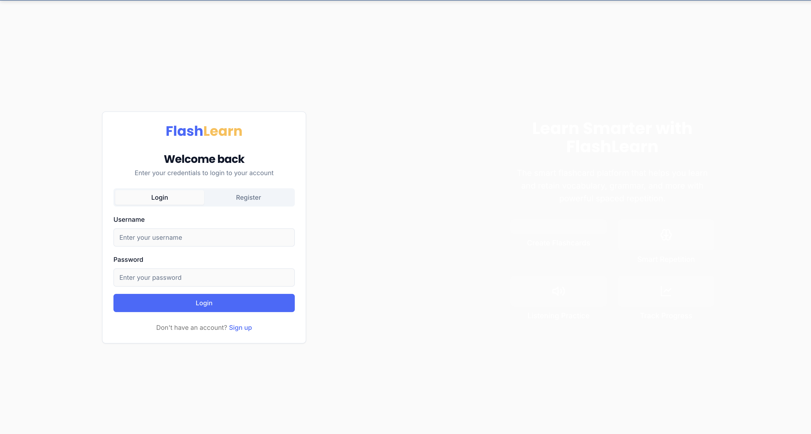

# SmartFlashLearn



**SmartFlashLearn** is a modern, full-stack flashcard application designed to make learning more efficient and engaging. It leverages spaced repetition algorithms and offers various quiz formats to cater to different learning styles. This project is open-source, and we welcome contributions!

## Table of Contents

- [About The Project](#about-the-project)
  - [Features](#features)
  - [Tech Stack](#tech-stack)
- [Getting Started](#getting-started)
  - [Prerequisites](#prerequisites)
  - [Installation & Setup](#installation--setup)
- [Usage](#usage)
- [Project Structure](#project-structure)
- [Contributing](#contributing)
- [License](#license)

## About The Project

SmartFlashLearn was built to provide a seamless and intelligent learning experience. Traditional flashcard apps can be passive. We've introduced active recall and spaced repetition to ensure that you're not just memorizing, but truly learning.

### Features

- **📚 Deck Management:** Create, customize, and organize your flashcard decks.
- **🌐 Public & Private Decks:** Share your knowledge with the community or keep your decks private.
- **🤖 Spaced Repetition:** Our smart algorithm schedules reviews at optimal intervals to maximize long-term retention.
- **✍️ Multiple Quiz Modes:** Engage with your material through various quiz types, including multiple-choice, typing, and even listening exercises.
- **📊 Progress Tracking:** Monitor your learning journey with detailed statistics on accuracy, streaks, and overall progress.
- **👤 User Authentication:** Secure user profiles to keep your learning data safe.

### Tech Stack

- **Frontend:** [React](https://reactjs.org/), [TypeScript](https://www.typescriptlang.org/), [Vite](https://vitejs.dev/), [Tailwind CSS](https://tailwindcss.com/)
- **UI Components:** [Shadcn UI](https://ui.shadcn.com/)
- **Backend:** [Node.js](https://nodejs.org/), [Express.js](https://expressjs.com/)
- **Database & Auth:** [Supabase](https://supabase.io/)
- **Data Fetching:** [TanStack Query (React Query)](https://tanstack.com/query/v4)
- **Routing:** [Wouter](https://github.com/molefrog/wouter)

## Getting Started

Follow these instructions to get a local copy of SmartFlashLearn up and running for development and testing.

### Prerequisites

- [Node.js](https://nodejs.org/en/download/) (v18.x or later recommended)
- [npm](https://www.npmjs.com/get-npm) (comes with Node.js)
- A [Supabase](https://supabase.com/) account for the database.

### Installation & Setup

1.  **Clone the repository:**
    ```sh
    git clone https://github.com/your-username/SmartFlashLearn.git
    cd SmartFlashLearn
    ```

2.  **Install dependencies:**
    ```sh
    npm install
    ```

3.  **Set up Supabase:**
    - Go to [app.supabase.com](https://app.supabase.com/) and create a new project.
    - Navigate to **Project Settings > API**. You will find your Project URL and `anon` public key here. You will also find your `service_role` key; make sure to keep this secret.
    - Navigate to your project's **SQL Editor**.
    - Open the `comprehensive-rls-fix.sql` file from this repository, copy its content, and run it in the SQL Editor. This will set up all the necessary tables, functions, and row-level security policies.

4.  **Configure Environment Variables:**
    - Create a `.env` file in the root directory of the project.
    - Copy the content below into the file and add your Supabase credentials.

    ```env
    # Supabase credentials for the server
    SUPABASE_URL="YOUR_SUPABASE_PROJECT_URL"
    SUPABASE_KEY="YOUR_SUPABASE_SERVICE_ROLE_KEY" # Found in Project Settings > API

    # Supabase credentials for the client (Vite)
    VITE_SUPABASE_URL="YOUR_SUPABASE_PROJECT_URL"
    VITE_SUPABASE_ANON_KEY="YOUR_SUPABASE_ANON_KEY" # Found in Project Settings > API
    ```
    > **Note:** The `SERVICE_ROLE_KEY` should be kept secret and is only used on the server. The `ANON_KEY` is safe to be exposed on the client.

## Usage

Once you have completed the setup, you can run the development server:

```sh
npm run dev
```

This will start the backend server and the frontend Vite server concurrently. Open your browser and navigate to `http://localhost:3001`.

## Project Structure

The codebase is organized into a few main directories:

-   `client/`: Contains the entire React frontend application, built with Vite.
    -   `src/pages/`: Top-level page components.
    -   `src/components/`: Reusable UI components.
    -   `src/hooks/`: Custom React hooks for logic like authentication.
    -   `src/lib/`: Utility functions and library configurations.
-   `server/`: Contains the Express.js backend server.
    -   `routes.ts`: Defines all the API endpoints.
    -   `storage.ts`: The data access layer that communicates with Supabase.
-   `shared/`: Contains TypeScript types and interfaces shared between the client and server.
-   `supabase/`: Contains database-related files, including migrations.

## Contributing

Contributions are what make the open-source community such an amazing place to learn, inspire, and create. Any contributions you make are **greatly appreciated**.

If you have a suggestion that would make this better, please fork the repo and create a pull request. You can also simply open an issue with the tag "enhancement".
Don't forget to give the project a star! Thanks again!

1.  Fork the Project
2.  Create your Feature Branch (`git checkout -b feature/AmazingFeature`)
3.  Commit your Changes (`git commit -m 'Add some AmazingFeature'`)
4.  Push to the Branch (`git push origin feature/AmazingFeature`)
5.  Open a Pull Request

## License

Distributed under the MIT License. 